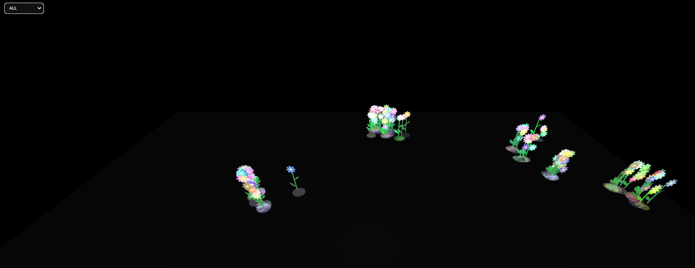
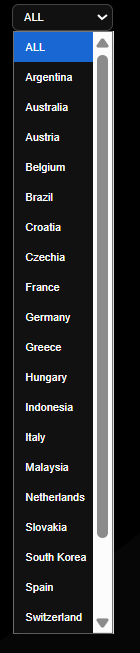

# Flowering Reviews 🌼

**What if every place you reviewed could grow into a flower?**

**Flowering Reviews** is an interactive creative coding project that transforms personal Google Maps reviews into a living 3D garden.

Each review becomes a plant. Ratings, review length, location, and life state influence how each plant grows, blooms, moves, or dies.

The project combines **creative coding**, **data visualization**, and **personal memory mapping** to explore how data can be felt visually, not only analyzed.

---

## Preview



---

## Concept

Most review data is usually displayed as tables, charts, or map pins.

This project turns that data into a more emotional and symbolic visual experience.

Each Google Maps review becomes a plant in a 3D garden:

- Higher-rated reviews grow into healthier plants.
- Higher-rated reviews stay alive and move softly with the wind.
- Lower-rated or negative reviews bloom briefly and then die.
- Longer reviews can create more flowers.
- Countries become spatial clusters.
- Plants bloom progressively, grow leaves, move organically, and follow a full lifecycle.

The result is a personal data garden where memories are represented as living forms.

---

## Visual System

Each plant follows a lifecycle:

```text
seed → grow → bloom → alive / dying → dead
```

### Plant Lifecycle

| State | Visual behavior |
|---|---|
| Seed | A soft colored seed halo appears on the ground before growth begins |
| Grow | The stem grows upward with its leaves |
| Bloom | Petals appear progressively in a circular sequence |
| Alive | The plant stays alive and moves softly with wind |
| Dying | The plant slowly falls while keeping its base |
| Dead | The plant disappears from the scene |

---

## Data Mapping

| Data field | Visual meaning |
|---|---|
| `rating` | Influences plant height and life state |
| `review_text` | Used to calculate review length |
| `text_length` | Influences flower count |
| `flower_count` | Number of flowers generated |
| `country` | Used for country clustering and selector |
| `lat` / `lon` | Used to position plants in the world |
| `life_state` | Defines whether the plant lives or dies |
| `place_name` | Displayed in the hover tooltip |

---

## Main Features

- Interactive 3D garden built with **p5.js** and **WEBGL**
- Plants generated from processed Google Maps review data
- Country-based clustering
- Country selector to focus on specific groups of reviews
- Smooth camera transitions between countries
- Animated plant lifecycle
- Progressive circular bloom animation
- Leaves growing from the stem during bloom
- Organic stem movement and wind sway
- Slower dying animation for low-rated reviews
- Hover tooltip with review information
- Custom flower favicon

---

## Screenshots

### Full Garden View


### Country Selector



### Bloom Animation


### Dying Plant Animation


---

## Tech Stack

### Creative Coding

- JavaScript
- p5.js
- WEBGL
- HTML
- CSS

### Data Processing

- Python
- pandas
- pycountry

### Development Tools

- VS Code
- Git / GitHub
- Local HTTP server

---

## Project Structure

```text
flowering-reviews/
├── app/
│   ├── index.html
│   ├── sketch.js
│   ├── plant.js
│   ├── stem.js
│   ├── seed.js
│   ├── flower_cluster.js
│   └── style.css
│
├── assets/
│   └── screenshots/
│       ├── flowering-reviews-preview.png
│       ├── country-selector.png
│       ├── bloom-animation.gif
│       └── dying-plant-animation.gif
│
├── data/
│   ├── raw/
│   └── processed/
│       └── garden_reviews.json
│
├── scripts/
│   └── process_reviews.py
│
└── README.md
```

---

## How to Run

### Option 1: Run from the project root

From the project root folder:

```bash
python -m http.server 8000
```

Then open:

```text
http://localhost:8000/app/
```

### Option 2: Run from inside the app folder

```bash
cd app
python -m http.server 8000
```

Then open:

```text
http://localhost:8000
```

---

## Data Processing

The raw Google Maps review data is processed before being loaded into the p5.js sketch.

The processing script standardizes and extracts:

- Place name
- Country
- Latitude
- Longitude
- Rating
- Review text
- Review length
- Flower count
- Plant height
- Life state

Run the processing script with:

```bash
python scripts/process_reviews.py
```

The processed file is saved as:

```text
data/processed/garden_reviews.json
```

The p5.js sketch then loads this file and generates the garden.

---

## Country Normalization

The data processing step also standardizes country names to avoid duplicate country clusters.

For example:

```text
Holy See
Holy See (Vatican City State)
```

can be normalized into:

```text
Vatican City
```

This keeps the country selector clean and avoids splitting the same location into multiple groups.

---

## Creative Coding Notes

The project avoids heavy geometry and focuses on lightweight animation techniques.

Instead of increasing the number of 3D objects, the garden uses:

- `scale()` for growth animation
- `alpha` for progressive appearance
- trigonometric motion for wind sway
- state-based animation
- smooth interpolation for camera movement

This helps keep the scene visually rich while maintaining better performance.

---

## Performance Considerations

The garden is designed to remain lightweight by:

- Reusing the same plant geometry
- Avoiding unnecessary object creation inside the draw loop
- Using simple mathematical animation
- Rendering only visible country clusters when filtered
- Keeping flower and leaf animations procedural

Future optimizations could include:

- Level of detail based on camera distance
- Rendering fewer plants in full world view
- Precomputing some plant properties
- Using simplified geometry for distant plants

---

## Future Improvements

- Add different flower species based on review categories
- Improve world map projection
- Add a timeline mode based on review date
- Add ambient sound or environmental effects
- Add color palettes based on emotional tone or review category
- Add a legend explaining the data-to-visual mapping
- Add exportable screenshots
- Improve mobile responsiveness
- Add more detailed clustering by region or continent

---

## Why This Project

**Flowering Reviews** started from a simple idea: the small recommendations we leave behind after everyday experiences can become something larger than we expect.

A review is usually treated as a small data point: a rating, a place name, a short comment. But behind each one there is a moment, a memory, a decision to share something with others. I wanted to explore how those small contributions could be transformed into a living garden, where every experience has the opportunity to grow.

In this garden, not every flower survives. Some reviews are not positive enough, or not “nourished” enough, to keep the plant alive for long. Others continue to bloom and move softly with the environment. This lifecycle became a way to represent how experiences can stay with us, fade away, or leave a visual trace.

I also wanted the project to feel personal and shareable. Every person’s reviews would generate a different garden: unique, unrepeatable, and shaped by their own memories, movements, and choices. The goal was not only to visualize data, but to let people see a part of their life represented as something organic and poetic.

This was one of the most creatively challenging projects I have worked on. Translating simple review data into a meaningful visual system required balancing symbolism, interaction, performance, and aesthetics. I had to work within the limitations of representation while still trying to create an experience that felt alive, emotional, and visually engaging.

I am very happy with the result because it became more than a technical experiment. It became a personal data garden: a way to turn everyday experiences into something that can grow, bloom, disappear, and be shared.

---

## Author

Created by **Facundo Contreras** as part of a creative coding and data visualization portfolio.